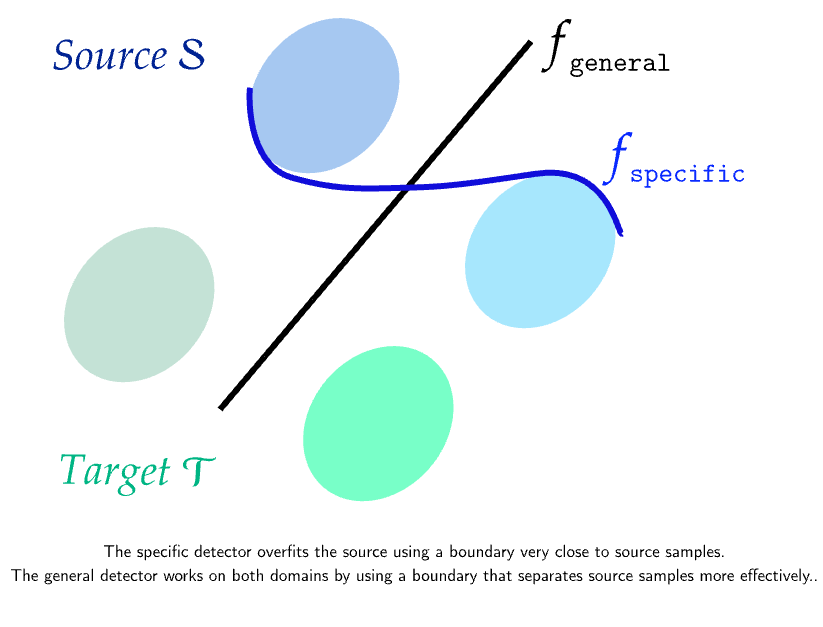

# Official repository for the paper :

## "Pick the Largest Margin for Robust Detection of Splicing (pre-print)"

  

[](#CitingUs)   [](https://arxiv.org/pdf/2409.03318)
 
### Julien Simon de Kergunic, Rony Abecidan, Patrick Bas, Vincent Itier


<br/>

*Abstract: Despite advancements in splicing detection, practitioners still struggle to fully leverage forensic tools from the literature due to a critical issue: deep learning-based detectors are extremely sensitive to their trained instances. Simple post-processing applied to evaluation images can easily decrease their performances, leading to a lack of confidence in splicing detectors for operational contexts. In this study, we show that a deep splicing detector behaves differently against unknown post-processes for different learned weights, even if it achieves similar performances on a test set from the same distribution as its training one. We connect this observation to the fact that different learnings create different latent spaces separating training samples differently. Our experiments reveal a strong correlation between the distributions of latent margins and the ability of the detector to generalize to post-processed images. We thus provide to the practitioner a way to build deep detectors that are more robust than others against post-processing operations, suggesting to train their architecture under different conditions and picking the one maximizing the latent space margin.*

<p align="center">
  
</p>


## Comments about the repo : 

- The file ```pipelines.csv``` is a directory of pipelines disclosing their parameters and identifying them with a number.

- The file ```training_results.csv``` is a directory of Bayar detectors for which we select precise hyperparameters and identifying them with a number.

- Details about the computation of latent margins are available in ```Experiments/README.md```
  
- To be able to reproduce our results, you need classical python library (e.g. numpy, matplotlib and pandas). A playground notebook is available in the ```Experiments``` folder to let you reproduce our results using these libraries.


## Main references

```BibTeX
@misc{jiang2019predictinggeneralizationgapdeep,
      title={Predicting the Generalization Gap in Deep Networks with Margin Distributions}, 
      author={Yiding Jiang and Dilip Krishnan and Hossein Mobahi and Samy Bengio},
      year={2019},
      eprint={1810.00113},
      archivePrefix={arXiv},
      primaryClass={stat.ML},
      url={https://arxiv.org/abs/1810.00113}, 
}


@inproceedings{10.1145/2909827.2930786,
author = {Bayar, Belhassen and Stamm, Matthew C.},
title = {A Deep Learning Approach to Universal Image Manipulation Detection Using a New Convolutional Layer},
year = {2016},
isbn = {9781450342902},
publisher = {Association for Computing Machinery},
address = {New York, NY, USA},
url = {https://doi.org/10.1145/2909827.2930786},
doi = {10.1145/2909827.2930786},
booktitle = {Proceedings of the 4th ACM Workshop on Information Hiding and Multimedia Security},
pages = {5–10},
numpages = {6},
keywords = {convolutional neural networks, image forensics, universal forgery detection},
location = {Vigo, Galicia, Spain},
series = {IH&MMSec '16}
}

```

---
<a name="CitingUs"></a>
## Citing our paper
### If you wish to refer to our paper,  please use the following BibTeX entry
```BibTeX

@unpublished{simondekergunic:hal-04688185,
  TITLE = {{Pick the Largest Margin for Robust Detection of Splicing}},
  AUTHOR = {Simon de Kergunic, Julien and Abecidan, Rony and Bas, Patrick and Itier, Vincent},
  URL = {https://hal.science/hal-04688185},
  NOTE = {working paper or preprint},
  YEAR = {2024},
  MONTH = Sep,
  KEYWORDS = {Signal Processing ; Image Processing ; Multimedia Forensics ; Digital Forensics ; Digital Image Forensics ; Machine Learning ; Deep Learning},
  PDF = {https://hal.science/hal-04688185/file/2024_wifs.pdf},
  HAL_ID = {hal-04688185},
  HAL_VERSION = {v1},
}

```
